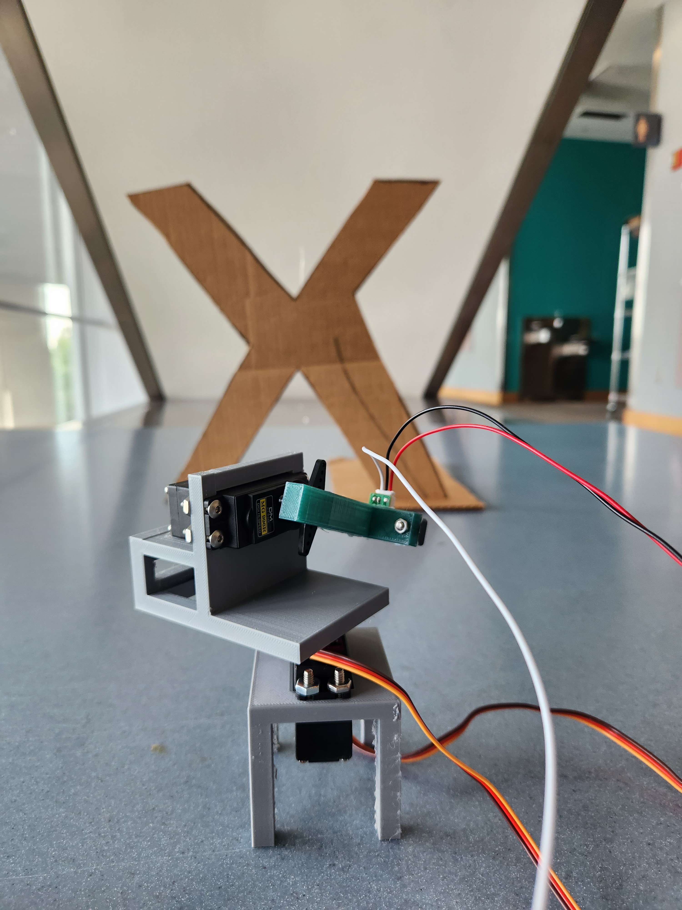
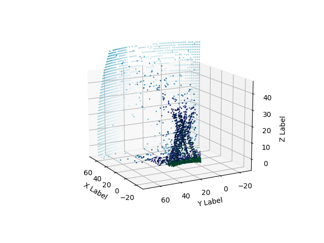
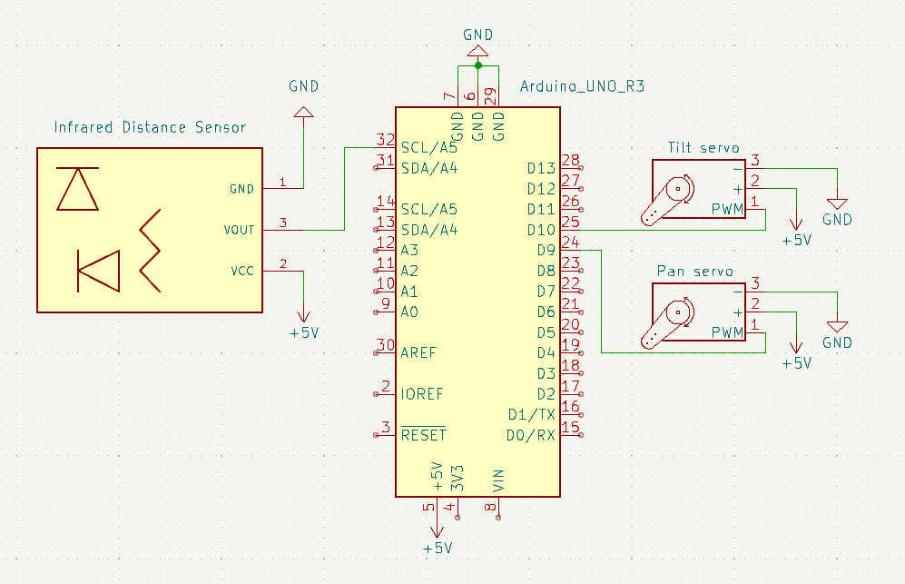

# 3D Scanner Project
Software written by: Dokyun Kim & [Juno Choi](https://github.com/jcuhnoio)
  
Mechanical design by: Satchel Schiavo

## Project Description
Second project of `Principles of Integated Engineering.` The goal is to make a pan-and-tilt mechanism using 2 servos that are controlled by an Arduino. There is also an [infrared distance sensor](https://pdf1.alldatasheet.com/datasheet-pdf/view/412633/SHARP/GP2Y0A02YK0F.html) used for gathering distance information. Then, the scanned environment is visualized in 3D.

## Project Demo

  

***Left** : Object scanned in real life. **Right**: 3D visualization of sensor data*

## Circuit Diagram

